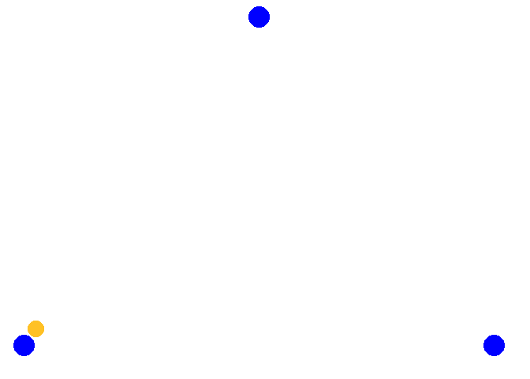

# Warm Up

## Spielformen


### Ausbaggern

Die Spieler stellen sich an beiden Enden des Feldes an. Der Ball wird immer abwechselnd im unteren Zuspiel direkt über das Netz gespielt. Nach jeder Ballberührung Lüft der Speiler auf die Andere Feldhälfte und stellt sich hinten an. Es ist darauf zu achten, dass die anderen Spieler nicht behindert werden. Wenn ein Fehler (Netz, Aus, nicht im unteren Zuspiel gespielt oder der Ball fällt auf den Boden) gemacht wird, beginnt der Spieler der den Fehler begangen hat von vorne und verliert ein Leben. Hat ein Spieler alle seine Leben verbraucht, scheidet er aus und macht sich solange individuell warm

##### Varianten {-}

* Der Ball wird über einen Bodenkontakt eingeschlagen statt eingeworfen
* Wenn der Ball auf den Boden fällt verliert der Spieler 2 Leben
* Es wird nur auf den 3-Meter-Raum gespielt

### Four-Square

...

## Übungen

### Spielen mit Nachlaufen

Drei bis vier Spieler stellen sich in 2 Gruppen gegenüber auf. Der Ball wird hin und her gespielt und man wechselt nach jedem Ballkontakt die Seite (dem eigenen Ball nachlaufen) und stellt sich hinten an.

##### Varianten {-}

* Oberes und unteres Zuspiel abwechseln
* Oberes Zuspiel im Sprung
* Jedesmal zum Ende des Laufens einen Hechtbagger oder Stemmschritt mit Sprung
* Einmal selbst zuspielen dabei um 180° drehen und dann über Kopf zurück
* Jeder Spieler hat einen Ball in der Hand und wirft sich den Ball selbst vor bevor er den Spielball zurückspielt und fängt danach seinen Ball. 

### Spielen mit Nachlaufen Diagonal

Drei bis vier Spieler spielen sich den Ball mit Nachlaufen zu. Dabei stehen sie diagonal im Feld und kreuzen den Weg mit einer zweiten Gruppe. Zusätzlich zu den Varianten in \@ref(spielen-mit-nachlaufen), kann noch über Eck gelaufen werden.

### Paralell Spielen und Position wechseln

Je zwei Spieler stehen parallel und spielen den Ball gleichzeitig hin und her. Nach jeder Ballberührung tauschen die Beiden (nicht parallelen Spieler) die Position.

##### Varianten {-}

* oberes und unters Zuspiel abwechseln
* den Ball über Kreuz spielen
* den Ball im Sprung zuspielen
* jeder Spieler hält zusätzlich noch einen Ball in der Hand und wirft sich diesen selbs vor und spielt dann den Spielball


```{r include = FALSE}

if(recalculate_parallel){
t1 <- data.frame(x_ball1=0.03, y_ball1=0,
                 x_ball2=0.03, y_ball2=1, 
                x1 = 0, y1 = 0,
                x2 = 0, y2 = 1,
                x3 = 1, y3 = 0,
                x4 = 1, y4 = 1,
                stringsAsFactors = FALSE)

t2 <- data.frame(x_ball1=0.97, y_ball1=0,
                 x_ball2=0.97, y_ball2=1, 
                x1 = 0, y1 = 1,
                x2 = 0, y2 = 0,
                x3 = 1, y3 = 0,
                x4 = 1, y4 = 1,
                stringsAsFactors = FALSE)

t3 <- data.frame(x_ball1=0.03, y_ball1=0,
                 x_ball2=0.03, y_ball2=1,
                x1 = 0, y1 = 1,
                x2 = 0, y2 = 0,
                x3 = 1, y3 = 1,
                x4 = 1, y4 = 0,
                stringsAsFactors = FALSE)


tl <- list(t1,t2,t3)


t <- tween_states(tl, tweenlength = 2, statelength = 0, ease = 'sine-in-out',  nframes = 150)


p <- ggplot(t) +
  geom_point(
  aes(x = x_ball1, y = y_ball1,
  frame = .frame),
  color = "goldenrod1",
  size = 7
  ) +
  geom_point(
  aes(x = x_ball2, y = y_ball2,
  frame = .frame),
  color = "goldenrod1",
  size = 7
  ) +
  geom_point(aes(x = x1, y = y1, frame = .frame),
  color = "blue",
  size = 9) +
  geom_point(aes(x = x2, y = y2, frame = .frame),
  color = "blue",
  size = 9) +
  geom_point(aes(x = x3, y = y3, frame = .frame),
  color = "blue",
  size = 9) +
  geom_point(aes(x = x4, y = y4, frame = .frame),
  color = "blue",
  size = 9) +
  theme_no_axes()
  
ani.options(interval = 1e-12)

gganimate(p, "img/paralell.gif", title_frame = F, saver = "gif")
}

```


```{r echo=FALSE}
knitr::include_graphics("img/paralell.gif")
```


### Spielen im Dreieck mit laufen

Die Spieler stellen sich im Dreieck auf. Der Ball wird in eine Richtung gespielt und der Spieler läuft in die andere Richtung, usw.

##### Varianten {-}

* Richtungswechsel (auf zuruf)
* Oberes Zuspiel im Sprung
* Oberes und unteres Zuspiel abwechseln


```{r include = FALSE}

if(recalculate_3eck){
t1 <- data.frame(x_ball=0.05, y_ball=0.05, 
                x1 = 0, y1 = 0,
                x2 = 1, y2 = 1,
                x3 = 2, y3 = 0,
                stringsAsFactors = FALSE)


t2 <- data.frame(x_ball=1, y_ball=0.95, 
                 x1 = 2.05, y1 = -0.05,
                 x2 = 1, y2 = 1,
                 x3 = 2, y3 = 0,
                 stringsAsFactors = FALSE)

t3 <- data.frame(x_ball=1.95, y_ball=0.05, 
                 x1 = 2.05, y1 = -0.05,
                 x2 = 0, y2 = 0,
                 x3 = 2, y3 = 0,
                 stringsAsFactors = FALSE)

t4 <- data.frame(x_ball=0.05, y_ball=0.05, 
                 x1 = 2., y1 = 0,
                 x2 = 0, y2 = 0,
                 x3 = 1, y3 = 1,
                 stringsAsFactors = FALSE)

tl <- list(t1,t2,t3,t4)


t <- tween_states(tl, tweenlength = 2, statelength = 0, ease = 'sine-in-out',  nframes = 150)


p <- ggplot(t)+
  geom_point(aes(x=x_ball, y=y_ball, frame = .frame), color ="goldenrod1", size =7)+
  geom_point(aes(x=x1, y=y1, frame = .frame), color ="blue", size =9)+
  geom_point(aes(x=x2, y=y2, frame = .frame), color ="blue", size =9)+
  geom_point(aes(x=x3, y=y3, frame = .frame), color ="blue", size =9)+
  theme_no_axes()


ani.options(interval = 10e-12)

gganimate(p, "img/3eck.gif", title_frame = F, saver = "gif")
}

```


```{r echo=FALSE}

```
