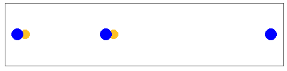

# Einspielen

## Paarweise

Die folgenden Übungen werden immer paarweise ausgeführt und eignen sich deshalb besonders um ins Einspielen integriert zu werden.

### Angriff mit Nachwerfen

Um eine hohe Kadenz an Abwehr/Annahmebewegungen zu erreichen, hält der Angriffsspieler 2 Bälle. Der erste Ball wird zuerst locker, im Laufe der Übung immer fester angegriffen. Der zweite Ball wird dann relativ bald hoch nach geworfen (Dankeball). Der Verteidigungsspieler wehrt den angegriffenen Ball ab und nimmt den geworfenen Ball danach an. Der Angriffsspieler fängt den Abgewehrten Ball und greift den Dankeball direkt an und wirft darauf den gefangen Ball nach [@hauser2016].

##### Varianten {-}

* Der Dankeball wird zu kurz, nach links oder nach rechts geworfen um eine Bewegung des Abwehrspielers zu erzwingen.
* Die Angriffe werden härter oder gelobt.

### Ball ins Gesicht

2 Spieler, 1 Ball. Der Ball wird vom Angriffsspieler auf den Abwehrspieler geworfen. Der Angriffsspieler zielt auf den Bereich der zwischen unterer und oberer Abwehr liegt, um die Entscheidung für eine von beiden Techniken und der Ausführung zu trainieren.

### Werfen mit 3 Bällen

Als Paar aufstellen, der Angriffsspieler hat 3 Bälle und wirft diese nacheinander dem Abwehrspieler zu, der sie hoch abwehrt, sodass der Angriffsspieler die Bälle einen nach dem Anderen fangen und wieder zurück werfen kann.

##### Varianten {-}

* Die Übung kann beliebig erschwert werden, indem die Bälle kürzer, länger oder seitlich versetzt geworfen werden. Es ist dann auf die Linie großer Zeh, Knie, Schulter zu achten

* Es können aufeinander gestellte Bänke zwischen den Spielern aufgestellt werden um das Netzt zu simulieren

### Abwehr mit drei Bällen

Als Paar aufstellen. Ein Spieler hat drei Bälle. Erst ein harter Angriff dann ein kurzer Ball und zum Abschluß ein hoher Ball, der erlaufen werden muss.


### Kurz, lang, kurz

Paarweise. Spieler 1 spielt langen Ball zu Spieler 2 und läuft nach. Spieler 2 spielt kurz vor sich zu Spieler 1, der wieder kurz zurück und kehrt auf seine ursprüngliche Position zurück. Spieler 2 spielt nun lang und läuft nun dem Ball nach und spielt den von Spieler 1 kurz gespielten Ball zurück und kehrt dann wieder zum Ursprung zurück. Und so weiter

##### Varianten {-}

* mit Baggern
* oberes Zuspiel im Sprung

### Lang, Mitte, Kurz

Paarweise, ein Angriffsspieler mit Rücken zum Netz und ein Abwehrspieler:

1. Langer Angriff
1. Mittel gelegt
1. kurz gelegt
1. Ein Zwischenspiel und von vorne

### Lang, kurz

Angriffsspieler mit rücken zum Netz greift lang an auf Abwehrspieler. Hohe Abwehr. Angriffsspieler legt den Ball kurz. Nach Zwischenspiel wieder langer Angriff usw.

##### Varianten {-}

* kurzer Ball muss im oberen  Zuspiel gespielt werden
* ...

### Zuspiel im Sprung

Die Spieler stehen sich im etwas geringerm Abstand gegenüber und spielen sich den Ball immer mit oberen Zuspiel im Sprung zu. Dabei daurauf achten, dass man immer einen kleinen Stemmschritt macht und sich nach jedem gespieltem Ball wieder zwei Schritte zurück zieht. Der Ball sollte gespielt werden wenn man gerade den höchsten Punkt überschritten hat, dadurch entsteht der Eindruck, man würde kurz in der Luft stehen.

### Zwischenspiel

Jeder Spieler spielt sich den Ball einmal selbst zu. Dabei gibt es verschiedene Varianten:

* Einmal kurzes oberes Zuspiel und lang zurück
* unteres Zuspiel und und oberes zurück
* kurzes oberes Zuspiel und um 180° drehen und über Kopf zurück
* unteres Zuspiel um 180° drehenh und über Kopf im oberen Zuspiel zurück
* Viele weitere Varianten denkbar


### Abwehr-Zuspiel-Angriff

Jeder Spieler wehrt den Ball zu sich selbst ab, spielt sich den Ball selbst zu und greift danach auf seinen Mitspieler an.

## Zu Dritt

### Russiche Abwehrübung

Drei Spieler, zwei Bälle. Die Spieler stehenh auf einer Linie und die äusseren Spieler werfen abwechselnd den Ball so, dass der Spieler in der Mitte immer ein paar Schritte machen muss, bis er den Ball spielen kann. Die Bälle sollen so geworfen werden, dass es für den Spieler in der Mitte anstrengend ist, aber eine saubere technische Ausführung möglich ist. Es ist auf eine volle Drehung zu achten.


```{r include = FALSE}

if(recalculate){
russian_drill <- tribble(~time, ~x_ball1, ~y_ball1,~x_ball2, ~y_ball2,~x2, ~y2,
  1, 0.03, 0, 0.38, 0, 0.35, 0,
  2, 0.62, 0, 0.97, 0, 0.65, 0,
  3, 0.03, 0, 0.38, 0, 0.35, 0)

russian_plot <- ggplot(russian_drill) +
  geom_point(aes(x = x_ball1, y = y_ball1), color = "goldenrod1", size = 7) +
  geom_point(aes(x = x_ball2, y = y_ball2), color = "goldenrod1", size = 7) +
  geom_point(aes(x = 0, y =0), color = "blue", size = 9) +
  geom_point(aes(x = x2, y = y2), color = "blue", size = 9) +
  geom_point(aes(x = 1, y = 0), color = "blue", size = 9) +
  theme_void() +
  transition_time(time) +
  ease_aes('sine-in-out')

anim_save("img/russisch.gif", russian_plot, height = 120)
}

```


```{r echo=FALSE}

```

##### Varianten {-}

* jeder zweite Ball wird angegriffen.


### Zuspiel aus der Mitte

3 Spieler stehen in einer Linie. der mittlere Spieler (Zuspieler) spielt den Ball einem der äusseren Spieler zu. Dieser greift auf sein Gegenüber an, der ihn wiederum zum Zuspieler abwehrt. Der Zuspieler stellt nun dem abwehrenden Spieler der wiederum angreift usw.

```{r include = FALSE}

if(recalculate){
set_middle <- tribble(~time,~x_ball1, ~y_ball1,
                      1,0.47, 0.19,
                      2,0.03, 0.1, 
                      3,0.97, 0.1, 
                      4,0.53, 0.19,
                      5,0.97, 0.1, 
                      6,0.03, 0.1, 
                      7,0.47, 0.19)
        

set_middle_plot <-
  ggplot(set_middle) +
    geom_point(
    aes(x = x_ball1, y = y_ball1), color = "goldenrod1", size = 7) +
    geom_point(aes(x = 0, y = 0.1), color = "blue", size = 9) +
    geom_point(aes(x =0.5, y = 0.2), color = "blue", size = 9) +
    geom_point(aes(x = 1, y = 0.1), color = "blue", size = 9) +
    theme_void()+
    transition_time(time)+
    ease_aes("sine-in-out")


anim_save("img/mitte.gif", set_middle_plot, height = 150)
}

```


```{r echo=FALSE}

```


##### Varianten {-}

* Der Zuspieler spielt immer im Sprung zu
* Der Zuspieler spielt über Kopf zu.
* Die Angreifer legen den Ball kurz.
* Nach dem Angriff tauschen Zuspieler und Angreifer den Platz.

## Koordination

Koordinative Übungen können sowohl ins Einspielen als auch im Training integriert werden. Die Übungen sollten immer fordernd sein, sonst haben sie keinen Trainingseffekt.

```{r echo= FALSE}
include_url("https://www.youtube.com//embed//9dzgovUkOsw")
```

### Parallel spielen mit 2 Bällen

Zwei Spieler spielen parallel mit 2 Bällen. Die Technik sollte vorgegeben werden. Zuerst oberes Zuspiel, unteres Zuspiel, oder abwechselnd.

### Spiel mit 3 Bällen

Zu zweit. Jeder Spieler hält einen Ball in der Hand. Mit einem dritten Ball wird hin und her gespielt. Der eigene Ball muss immer passend hochgeworfen und wieder gefangen werden.

### Ein Spieler 2 Bälle

Ein Spieler hält einen Ball in jeder Hand das gegenüber spielt einen Ball zu. Der Spieler mit den beiden Bällen in der Hand wirft diese rechtzeitig hoch um den vom Partner geworfenen Ball zu spielen und fängt anschließend seine eigenen Bälle wieder.

Die Übung kann dadurch erschwert werden, dass kleinere Gegenstände benutzt werden, z.B. Tennisbälle.

### Drei Spieler 4 Bälle

Wie [Spielen mit Nachlaufen], allerdings hat jeder Spieler einen Ball in der Hand und wirft sich den Ball selbst zu, spielt unter dessen den Spielball, fängt seinen eigenen Ball und läuft dem Spielball nach.

### Zwei gegen Zwei mit 3 Bällen

Gespielt wird auf den (halben) 3-Meter-Raum jedes 2er Team hat einen (Team-) Ball und ein dritter (Spiel-) Ball wird mit 3 Berührungen normal ausgespielt. Die Schwierigkeit ist, dass keiner der beiden Bälle den Boden berühren darf. Der Teamball darf also nicht abgelegt werden. Der Teamball kann entweder sich selbst zugenworfen werden oder zum Teamkollegen, er darf aber nicht den Boden berühren. Für den Spielball zählen normale Volleyball regeln. Wenn einer der beiden Bälle den Boden berührt oder ein andere Fehler begangen wird, zählt der Punkt als verloren. Das Team das einen Fehler begangen hat wird durch das nächste wartende Team ersetzt.

##### Varianten {-}

* jeder Spieler hält einen Ball in der Hand
* 3 gegen 3 mit 5/7 Bällen

```{r echo= FALSE}
include_url("https://www.youtube.com/embed/5yaXifUSr9s")
```

## Mit Tennisbällen

### Ball gegen die Wand

Der Ball wird abwechselnd mt links und rechts gegen die Wand geworfen und mit der jeweils anderen Hand gefangen. Daurauf achten, dass der Ball mit den Fingern gefangen wird und nicht mit dem Ballen. Die Schwierigkeit kann durch den Abstand zur Wand und das Tempo mit dem geworfen wir variiert werden.

### Ball gegen die Wand II

Zwei Spieler. Spieler eins steht in Abwehrhaltung mit Blick auf die Wand. Spieler zwei wirft den Ball von hinten gegen die Wand und Spieler 1 fängt. Mit beiden Händen und danach mit einer Hand. Schwierigkeit mit Abstand zur Wand und Geschwindigkeit varieren.

##### Varianten

* Ein Auge geschlossen


## Agility Ladder

```{r echo= FALSE}
include_url("https://www.youtube.com/embed/67XP-AekUoA")
```

## Reaction Ball

```{r echo= FALSE}
include_url("https://www.youtube.com/embed/vpKXcVFI8f0")
```

