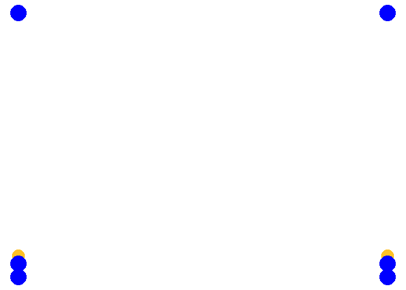

# Komplex

## Diagonalspiel

Auf beiden Feldhälften wird eine Mannschaft mit mindesten 3 Spielern aufgestellt. Benötigt wird ein Zuspieler auf Position 2 ein Angreifer auf Position 4 und ein Abwehrspieler auf Position 5. Der Ball wird durch einwerfen ins Spiel gebracht. Danach wird der Ball ausgespielt und (leicht) diagonal angegriffen. Nachdem der Ball das Netz überquert hat, rotiert die Mannschaft eine Position weiter und auf der anderen Feldhälfte wird der Ball ausgespielt und nach dem diagonalen Angriff ebenfalls eine Position weiter rotiert. Nach einem Fehler wird der Ball möglichst schnell wieder ins Spiel gebracht. Falls mehr Spieler vorhanden sind, werden weitere Positionen aufgefüllt beginnend mit Position 6.

##### Varianten {-}

* Spieler auf Position 4 beginnt in Blockposition am Netz und zieht sich erst beim Zuspiel vom Netz zurück.
* Die Richtung wird gewechselt
* Alle Spieler gehen zur Angriffssicherung
* Der Zuspieler versucht zu blocken um die Anggriffssicherung zu testen

## Kreisel

### Vierer Kreisel

Vier Spieler verteilen sich wie folgt aufs Feld: Ein Zuspieler auf Position 3, jeweils ein Angriff/Abwehrspieler auf Position 2 und 4 und ein Abwehrspieler auf Position 6. Der Zuspieler Spielt immer abwechselnd auf Position 2 oder 4. Von dieser Position wird diagonal Angegriffen. Der nicht angreifende Netzspieler zieht sich zurück (ca. 3-Meterlinie) der Spieler von Position 6 schließt an, so dass sie sich nicht behindern. Die Abwehr erfolgt zum Zuspieler der nun den Ball wieder zuspielt usw...

Wichtig ist darauf zu achten, dass die Spieler immer wieder auf ihre Position zurückkehren, damit vor jeder Abwehr eine Bewegung erfolgt

##### Varianten {-}

+ Der Zuspieler spielt nicht abwechselnd, sondern zufällig auf Position 2 oder 4.
+ Angriff im Sprung
+ Zuspiel im Sprung

### Fünfer Kreisel

Wie [Vierer Kreisel] nur stehen auf Position 6 zwei Spieler, die verschieben. Auf die Abstimmung zwischen den Spielern achten


### Sechser Kreisel

```{r echo= FALSE}
include_url("https://www.youtube.com//embed/32BplDj0tT0?rel=0")
```


### Achter Kreisel

Wie [Sechser Kreisel], mit der Ausnahme, dass es einen oder 2 dedizierte Zuspieler gibt, der von außerhalb des Feldes einläuft.

## Diagonal Angriff mit Nachlaufen

Jeweils ein Spieler auf Position 1-5 die restlichen Spieler stellen sich hinter Position 6 an. Der Ball wird durch Einwurf von Position 6 auf Position 3 ins Spiel gebracht und der Spieler von Position 6 läuft auf Position 3. Position 3 spielt den Ball auf Position 2 oder 4 (z. B. abwechselnd) und folgt seinem Ball. Position 2 oder 4 schlagen den Ball (leicht) auf Position 1 oder 5 und folgen ihrem Ball. Position 1 und 5 wehren auf Position 3 ab und stellen sich hinter Position 6 an. Position 6 läuft auf Position 3 ein, sobald 3 den Ball nach vorne oder über Kopf gespielt hat.

(Grafik fehlt noch)

## Longline Pritschen, diagonal Baggern mit Nachlaufen

Alle vier Ecken eines Feldes werden besetzt in den Ecken am Netz stehen jeweils 2 Spieler hintereinander. Die vorderen Spieler am Netz haben jeweils einen Ball und beginnen damit den Ball longline zu spielen und dem eigenen Ball nach zu laufen. Die Spieler auf Position 1 und 5 baggern den Ball diagonal zum jeweils verbliebenen Spieler am Netz und folgen ihrem Ball. Der Spieler am Netz spielt nun wieder longline und folgt seinem Ball. Dies wird solange wiederholt bis ein Fehler passiert

##### Varianten {-}

* Oberes Zuspiel im Sprung


```{r include = FALSE}

if(recalculate){
t1 <- data.frame(x_ball1=0, y_ball1=0.08,
                 x_ball2=1, y_ball2=0.08, 
                x1 = 0, y1 = 0.05,
                x2 = 0, y2 = 0,
                x3 = 1, y3 = 0.05,
                x4 = 1, y4 = 0,
                x5 = 0, y5 = 1,
                x6 = 1, y6 = 1,
                stringsAsFactors = FALSE)

t2 <- data.frame(x_ball1=0, y_ball1=0.97,
                 x_ball2=1, y_ball2=0.97, 
                x1 = 0, y1 = 0.5,
                x2 = 0, y2 = 0.05,
                x3 = 1, y3 = 0.5,
                x4 = 1, y4 = 0.05,
                x5 = 0, y5 = 1,
                x6 = 1, y6 = 1,
                stringsAsFactors = FALSE)

t3 <- data.frame(x_ball1=1, y_ball1=0.08,
                 x_ball2=0, y_ball2=0.08, 
                x1 = 0, y1 = 1,
                x2 = 0, y2 = 0.05,
                x3 = 1, y3 = 1,
                x4 = 1, y4 = 0.05,
                x5 = 0.5, y5 = 0.5,
                x6 = 0.5, y6 = 0.5,
                stringsAsFactors = FALSE)

t4 <- data.frame(x_ball1=1, y_ball1=0.97,
                 x_ball2=0, y_ball2=0.97, 
                x1 = 0, y1 = 1,
                x2 = 0, y2 = 0.5,
                x3 = 1, y3 = 1,
                x4 = 1, y4 = 0.5,
                x5 = 1, y5 = 0,
                x6 = 0, y6 = 0,
                stringsAsFactors = FALSE)

t5 <- data.frame(x_ball1=0, y_ball1=0.08,
                 x_ball2=1, y_ball2=0.08, 
                x1 = 0.5, y1 = 0.5,
                x2 = 0, y2 = 1,
                x3 = 0.5, y3 = 0.5,
                x4 = 1, y4 = 1,
                x5 = 1, y5 = 0.05,
                x6 = 0, y6 = 0.05,
                stringsAsFactors = FALSE)


tl <- list(t1,t2,t3,t4,t5)


t <- tween_states(tl, tweenlength = 2, statelength = 0, ease = 'sine-in-out',  nframes = 150)


p <- ggplot(t) +
  geom_point(aes(x = x_ball1, y = y_ball1,frame = .frame),color = "goldenrod1", size = 7) +
  geom_point(aes(x = x_ball2, y = y_ball2,frame = .frame),color = "goldenrod1", size = 7) +
  geom_point(aes(x = x1, y = y1, frame = .frame), color = "blue", size = 9) +
  geom_point(aes(x = x2, y = y2, frame = .frame), color = "blue", size = 9) +
  geom_point(aes(x = x3, y = y3, frame = .frame), color = "blue", size = 9) +
  geom_point(aes(x = x4, y = y4, frame = .frame), color = "blue", size = 9) +
  geom_point(aes(x = x5, y = y5, frame = .frame), color = "blue", size = 9) +
  geom_point(aes(x = x6, y = y6, frame = .frame), color = "blue", size = 9) +
  theme_no_axes()
  
ani.options(interval = 1e-12)

gganimate(p, "C:/Projekte/Volleyball/img/long_diag.gif", title_frame = F, saver = "gif")
}

```


```{r echo=FALSE}

```


